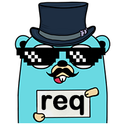

# req

<p align="center">
    <p align="center"></p>
    <p align="center"><strong>Simple Go HTTP client with Black Magic</strong></p>
    <p align="center">
        <a href="https://github.com/imroc/req/actions/workflows/ci.yml?query=branch%3Amaster"></a>
        <a href="https://codecov.io/gh/imroc/req/branch/master"></a>
        <a href="https://goreportcard.com/report/github.com/imroc/req/v3"></a>
        <a href="https://pkg.go.dev/github.com/imroc/req/v3"></a>
        <a href="LICENSE"></a>
        <a href="https://github.com/imroc/req/releases"></a>
        <a href="https://github.com/avelino/awesome-go"></a>
    </p> 
</p>

## Documentation

Full documentation is available on the official website: https://req.cool.

## <a name="Features">Features</a>

* **Simple and Powerful**: Providing rich client-level and request-level settings, all of which are intuitive and chainable methods, and the request-level setting takes precedence if both are set.
* **Easy Debugging**: Powerful and convenient debug utilities, including debug logs, performance traces, and even dump the complete request and response content (see [Debugging](https://req.cool/docs/tutorial/debugging/)).
* **Easy API Testing**: API testing can be done with minimal code, no need to explicitly create any Requests and Clients, or even to handle errors (See [Quick HTTP Test](https://req.cool/docs/tutorial/quick-test/))
* **Smart by Default**: Detect and decode to utf-8 automatically if possible to avoid garbled characters (See [Auto Decode](https://req.cool/docs/tutorial/auto-decode/)), marshal request body and unmarshal response body automatically according to the Content-Type.
* **Works fine with HTTP2**: Support both with HTTP/2 and HTTP/1.1, and HTTP/2 is preferred by default if server support, you can also force the protocol if you want (See [Force HTTP version](https://req.cool/docs/tutorial/force-http-version/)).
* **Support Retry**: Support automatic request retry and is fully customizable (See [Retry](https://req.cool/docs/tutorial/retry/)).
* **Easy Download and Upload**: You can download and upload files with simple request settings, and even set a callback to show real-time progress (See [Download](https://req.cool/docs/tutorial/download/) and [Upload](https://req.cool/docs/tutorial/upload/)).
* **Exportable**: `Transport` is exportable, which support dump requests, it's easy to integrate with existing http.Client, so you can debug APIs with minimal code change.
* **Extensible**: Support Middleware for Request and Response (See [Request and Response Middleware](https://req.cool/docs/tutorial/middleware/)).

## <a name="Get-Started">Get Started</a>

**Install**

``` sh
go get github.com/imroc/req/v3
```

**Import**

```go
import "github.com/imroc/req/v3"
```

**Basic Usage**

```go
// For testing, you can create and send a request with the global wrapper methods
// that use the default client behind the scenes to initiate the request (you can
// just treat package name `req` as a Client or Request, no need to create any client
// or Request explicitly).
req.DevMode() //  Use Client.DevMode to see all details, try and surprise :)
req.Get("https://httpbin.org/get") // Use Request.Get to send a GET request.

// In production, create a client explicitly and reuse it to send all requests
client := req.C(). // Use C() to create a client and set with chainable client settings.
    SetUserAgent("my-custom-client").
    SetTimeout(5 * time.Second).
    DevMode()
resp, err := client.R(). // Use R() to create a request and set with chainable request settings.
    SetHeader("Accept", "application/vnd.github.v3+json").
    SetPathParam("username", "imroc").
    SetQueryParam("page", "1").
    SetResult(&result). // Unmarshal response into struct automatically if status code >= 200 and <= 299.
    SetError(&errMsg). // Unmarshal response into struct automatically if status code >= 400.
    EnableDump(). // Enable dump at request level to help troubleshoot, log content only when an unexpected exception occurs.
    Get("https://api.github.com/users/{username}/repos")
if err != nil {
    // Handle error.
    // ...
    return
}
if resp.IsSuccess() {
    // Handle result.
    // ...
    return
}
if resp.IsError() {
    // Handle errMsg.	
    // ...
    return
}
// Handle unexpected response (corner case).
err = fmt.Errorf("got unexpected response, raw dump:\n%s", resp.Dump())
// ...
```

**Videos**

* [Get Started With Req](https://www.youtube.com/watch?v=k47i0CKBVrA) (English, Youtube)
* [快速上手 req](https://www.bilibili.com/video/BV1Xq4y1b7UR) (Chinese, BiliBili)

**More**

Check more introduction, tutorials, examples, best practices and API references on the [official website](https://req.cool/).

## <a name="License">License</a>

`Req` released under MIT license, refer [LICENSE](LICENSE) file.
