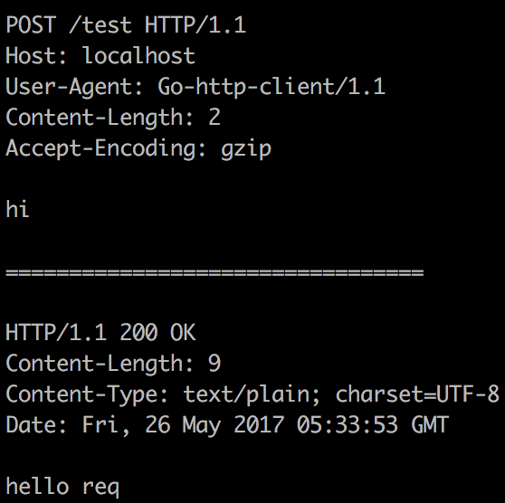

# req
[](https://godoc.org/github.com/imroc/req)

Go语言人性化HTTP请求库


特性
========

- 轻量级
- 简单
- 容易操作JSON和XML
- 容易调试和日志记录
- 容易上传和下载文件
- 容易管理Cookie
- 容易设置代理
- 容易设置超时
- 容易自定义HTTP客户端

安装
=======
``` sh
go get github.com/imroc/req
```

概要
=======
`req` 基于标准库 `net/http` 实现了一个友好的API.  
  
`Req` 和 `Resp` 是两个最重要的结构体, 你可以把 `Req` 看作客户端， 把`Resp` 看作存放请求及其响应的容器，它们都提供许多简洁方便的API，让你可以很轻松做很多很多事情。
``` go
func (r *Req) Post(url string, v ...interface{}) (*Resp, error)
```  

大多情况下，发起请求只有url是必选参数，其它都可选，比如请求头、请求参数、文件或请求体等。

包中含一个默认的 `Req` 对象, 它所有的公有方法都被`req`包对应的公有方法包装了，所以大多数情况下，你直接可以把`req`包看作一个`Req`对象来使用。
``` go
// 创建Req对象来发起请求
r := req.New()
r.Get(url)

// 直接使用req包发起请求
req.Get(url)
```
你可以使用 `req.New()` 方法来创建 `*Req` 作为一个单独的客户端

例子
=======
[基础用法](#Basic)  
[设置请求头](#Set-Header)  
[设置请求参数](#Set-Param)  
[设置请求体](#Set-Body)  
[调试](#Debug)  
[输出格式](#Format)  
[ToJSON & ToXML](#ToJSON-ToXML)  
[获取 *http.Response](#Response)  
[上传](#Upload)  
[下载](#Download)  
[Cookie](#Cookie)  
[设置超时](#Set-Timeout)  
[设置代理](#Set-Proxy)  
[自定义 http.Client](#Customize-Client)  

## <a name="Basic">基础用法</a>
``` go
header := req.Header{
	"Accept":        "application/json",
	"Authorization": "Basic YWRtaW46YWRtaW4=",
}
param := req.Param{
	"name": "imroc",
	"cmd":  "add",
}
// 只有url必选，其它参数都是可选
r, err = req.Post("http://foo.bar/api", header, param)
if err != nil {
	log.Fatal(err)
}
r.ToJSON(&foo)       // 响应体转成对象
log.Printf("%+v", r) // 打印详细信息
```

## <a name="Set-Header">设置请求头</a>
使用 `req.Header` (它实际上是一个 `map[string]string`)
``` go
authHeader := req.Header{
	"Accept":        "application/json",
	"Authorization": "Basic YWRtaW46YWRtaW4=",
}
req.Get("https://www.baidu.com", authHeader, req.Header{"User-Agent": "V1.1"})
```
使用 `http.Header`
``` go
header := make(http.Header)
header.Set("Accept", "application/json")
req.Get("https://www.baidu.com", header)
```

## <a name="Set-Param">设置请求参数</a>
Use `req.Param` (它实际上是一个 `map[string]interface{}`)
``` go
param := req.Param{
	"id":  "imroc",
	"pwd": "roc",
}
req.Get("http://foo.bar/api", param) // http://foo.bar/api?id=imroc&pwd=roc
req.Post(url, param)                  // 请求体 => id=imroc&pwd=roc
```
使用 `req.QueryParam` 强制将请求参数拼在url后面 (它实际上也是一个 `map[string]interface{}`)
``` go
req.Post("http://foo.bar/api", req.Param{"name": "roc", "age": "22"}, req.QueryParam{"access_token": "fedledGF9Hg9ehTU"})
/*
POST /api?access_token=fedledGF9Hg9ehTU HTTP/1.1
Host: foo.bar
User-Agent: Go-http-client/1.1
Content-Length: 15
Content-Type: application/x-www-form-urlencoded;charset=UTF-8
Accept-Encoding: gzip

age=22&name=roc
*/
```

## <a name="Set-Body">设置请求体</a>
Put `string`, `[]byte` and `io.Reader` as body directly.
``` go
req.Post(url, "id=roc&cmd=query")
```
将对象作为JSON或XML请求体（自动添加 `Content-Type` 请求头）
``` go
req.Post(url, req.BodyJSON(&foo))
req.Post(url, req.BodyXML(&bar))
```

## <a name="Debug">调试</a>
将全局变量 `req.Debug` 设置为`true`，将会把所有请求的详细信息打印在标准输出。
``` go
req.Debug = true
req.Post("http://localhost/test" "hi")
```


## <a name="Format">输出格式</a>
您可以使用指定类型的输出格式在日志文件中记录请求和响应的信息。例如，在开发阶段使用`％+v`格式，可以让你观察请求和响应的细节信息。 在生产阶段使用`％v`或`％-v`输出格式，只记录所需要的信息。

### `%+v` 或 `%+s`
详细输出
``` go
r, _ := req.Post(url, header, param)
log.Printf("%+v", r) // 输出格式和Debug开启时的格式一样
```

### `%v` 或 `%s`
简单输出（默认格式）
``` go
r, _ := req.Get(url, param)
log.Printf("%v\n", r) // GET http://foo.bar/api?name=roc&cmd=add {"code":"0","msg":"success"}
log.Prinln(r)         // 和上面一样
```

### `%-v` 或 `%-s`
简单输出并保持所有内容在一行内（请求体或响应体可能包含多行，这种格式会将所有换行、回车替换成`" "`, 这在会让你在查日志的时候非常有用）

### Flag
你可以调用 `SetFlags` 控制输出内容，决定哪些部分能够被输出。
``` go
const (
	LreqHead  = 1 << iota // 输出请求首部（包含请求行和请求头）
	LreqBody              // 输出请求体
	LrespHead             // 输出响应首部（包含响应行和响应头）
	LrespBody             // 输出响应体
	Lcost                 // 输出请求所消耗掉时长
	LstdFlags = LreqHead | LreqBody | LrespHead | LrespBody
)
```
``` go
req.SetFlags(req.LreqHead | req.LreqBody | req.LrespHead)
```

### 监控请求耗时
``` go
req.SetFlags(req.LstdFlags | req.Lcost) // 输出格式显示请求耗时
r,_ := req.Get(url)
log.Println(r) // http://foo.bar/api 3.260802ms {"code":0 "msg":"success"}
if r.Cost() > 3 * time.Second { // 检查耗时
	log.Println("WARN: slow request:", r)
}
```

## <a name="ToJSON-ToXML">ToJSON & ToXML</a>
``` go
r, _ := req.Get(url)
r.ToJSON(&foo)
r, _ = req.Post(url, req.BodyXML(&bar))
r.ToXML(&baz)
```

## <a name="Response">获取 *http.Response</a>
```go
// func (r *Req) Response() *http.Response
r, _ := req.Get(url)
resp := r.Response()
fmt.Println(resp.StatusCode)
```

## <a name="Upload">上传</a>
使用 `req.File` 匹配文件
``` go
req.Post(url, req.File("imroc.png"), req.File("/Users/roc/Pictures/*.png"))
```
使用 `req.FileUpload` 细粒度控制上传
``` go
file, _ := os.Open("imroc.png")
req.Post(url, req.FileUpload{
	File:      file,
	FieldName: "file",       // FieldName 是表单字段名
	FileName:  "avatar.png", // Filename 是要上传的文件的名称，我们使用它来猜测mimetype，并将其上传到服务器上
})
```
使用`req.UploadProgress`监听上传进度
```go
progress := func(current, total int64) {
	fmt.Println(float32(current)/float32(total)*100, "%")
}
req.Post(url, req.File("/Users/roc/Pictures/*.png"), req.UploadProgress(progress))
fmt.Println("upload complete")
```

## <a name="Download">下载</a>
``` go
r, _ := req.Get(url)
r.ToFile("imroc.png")
```
使用`req.DownloadProgress`监听下载进度
```go
progress := func(current, total int64) {
	fmt.Println(float32(current)/float32(total)*100, "%")
}
r, _ := req.Get(url, req.DownloadProgress(progress))
r.ToFile("hello.mp4")
fmt.Println("download complete")
```

## <a name="Cookie">Cookie</a>
默认情况下，底层的 `*http.Client` 会自动管理你的cookie（如果服务器给你发了cookie，之后的请求它会自动带上cookie请求头给服务器）, 你可以调用这个方法取消自动管理：
``` go
req.EnableCookie(false)
```
你还可以在发送请求的时候自己传入 `*http.Cookie`
``` go
cookie := new(http.Cookie)
// ......
req.Get(url, cookie)
```

## <a name="Set-Timeout">设置超时</a>
``` go
req.SetTimeout(50 * time.Second)
```

## <a name="Set-Proxy">设置代理</a>
默认情况下，如果系统环境变量有 `http_proxy` 或 `https_proxy` ，req会讲对应的地址作为对应协议的代理，你也可以自定义设置代理，或者将其置为`nil`，即取消代理。
``` go
req.SetProxy(func(r *http.Request) (*url.URL, error) {
	if strings.Contains(r.URL.Hostname(), "google") {
		return url.Parse("http://my.vpn.com:23456")
	}
	return nil, nil
})
```
设置简单代理（将所有请求都转发到指定代理url地址上）
``` go
req.SetProxyUrl("http://my.proxy.com:23456")
```

## <a name="Customize-Client">自定义HTTP客户端</a>
使用 `SetClient` 改变底层的 `*http.Client`
``` go
req.SetClient(client)
```
给某个请求制定特定的 `*http.Client`
``` go
client := &http.Client{Timeout: 30 * time.Second}
req.Get(url, client)
```
改变底层 `*http.Client` 的某些属性
``` go
req.Client().Jar, _ = cookiejar.New(nil)
trans, _ := req.Client().Transport.(*http.Transport)
trans.MaxIdleConns = 20
trans.TLSHandshakeTimeout = 20 * time.Second
trans.DisableKeepAlives = true
trans.TLSClientConfig = &tls.Config{InsecureSkipVerify: true}
```
